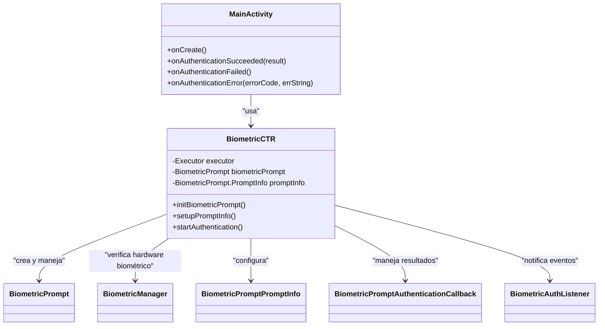

# Autenticación Biométrica en Android - Biometric_Auth_Verif

Este proyecto implementa una autenticación biométrica en Android utilizando `BiometricPrompt` para admitir huella dactilar, reconocimiento facial o credenciales del dispositivo (PIN, patrón o contraseña). La lógica de autenticación está encapsulada en una clase reutilizable llamada `BiometricCTR`, lo que permite su uso en cualquier parte de la aplicación sin duplicar código.

## Estructura del Proyecto

### 1. **BiometricCTR**

La clase `BiometricCTR` se encarga de toda la lógica relacionada con la autenticación biométrica. Proporciona una API sencilla y reutilizable para verificar si el dispositivo soporta biometría, configurar la autenticación y procesar los resultados.

#### Métodos principales de `BiometricCTR`:

- **initBiometricPrompt()**: Verifica si el dispositivo tiene hardware biométrico disponible y si se han registrado datos biométricos.
- **setupPromptInfo()**: Configura la información que será mostrada en el cuadro de diálogo de autenticación biométrica.
- **startAuthentication()**: Inicia el proceso de autenticación biométrica cuando el usuario lo solicite.

#### `BiometricAuthListener` (Interfaz):

Este listener es utilizado para gestionar los eventos de autenticación, permitiendo que cada actividad maneje la autenticación exitosa, fallida o cualquier error.

- **onAuthenticationSucceeded(BiometricPrompt.AuthenticationResult result)**: Se ejecuta cuando la autenticación biométrica es exitosa.
- **onAuthenticationFailed()**: Se ejecuta cuando la autenticación falla.
- **onAuthenticationError(int errorCode, CharSequence errString)**: Se ejecuta cuando ocurre un error durante la autenticación.

### 2. **MainActivity (o cualquier otra actividad)**

La `MainActivity` (o cualquier actividad que necesite autenticación) implementa la interfaz `BiometricAuthListener` y utiliza una instancia de `BiometricCTR` para gestionar el proceso de autenticación. El código dentro de la actividad se mantiene limpio, ya que toda la lógica biométrica está en `BiometricCTR`.

#### Ejemplo de uso en `MainActivity`:

```java
public class MainActivity extends AppCompatActivity implements BiometricCTR.BiometricAuthListener {

    private BiometricCTR biometricCTR;

    @Override
    protected void onCreate(Bundle savedInstanceState) {
        super.onCreate(savedInstanceState);
        setContentView(R.layout.activity_main);

        // Inicializar BiometricCTR
        biometricCTR = new BiometricCTR(this, this);

        // Configurar autenticación biométrica
        biometricCTR.initBiometricPrompt();
        biometricCTR.setupPromptInfo();

        // Botón para iniciar la autenticación
        Button biometricLoginButton = findViewById(R.id.biometric_login);
        biometricLoginButton.setOnClickListener(view -> biometricCTR.startAuthentication());
    }

    @Override
    public void onAuthenticationSucceeded(BiometricPrompt.AuthenticationResult result) {
        // Manejamos autenticación exitosa
        Toast.makeText(this, "Autenticación biométrica exitosa", Toast.LENGTH_SHORT).show();
    }

    @Override
    public void onAuthenticationFailed() {
        // Manejamos autenticación fallida
        Toast.makeText(this, "Fallo en la autenticación", Toast.LENGTH_SHORT).show();
    }

    @Override
    public void onAuthenticationError(int errorCode, CharSequence errString) {
        // Manejamos error en autenticación
        Toast.makeText(this, "Error de autenticación: " + errString, Toast.LENGTH_SHORT).show();
    }
}
```
### Diagrama de Arquitectura


> [!IMPORTANT] 
> ## Implementación

### 1. **Agregar Dependencias**

Asegúrate de que tu archivo `build.gradle` tenga las siguientes dependencias:

```gradle
dependencies {
    implementation 'androidx.biometric:biometric:1.2.0'
    implementation 'androidx.biometric:biometric-ktx:1.4.0-alpha02'
}
```

## Autor

- [Sento Marcos](https://github.com/SentoMarcos "SentoMarcos")
